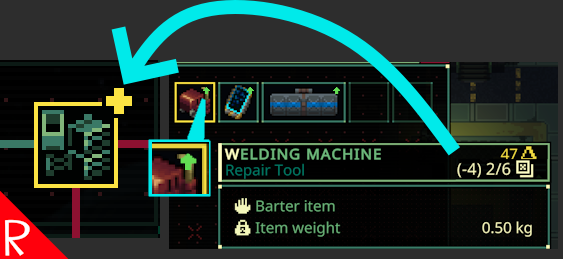

# Quasimorph Show Needed Upgrade Resources

Ever been in the dungeon and trying to remember if a resource is still needed for Magnum upgrades?

The game already contains a X/Y in the tool tip which indicates how much of an item is still needed for magnum upgrades.

However, this mod adds a green arrow on the actual item so the needed items can be identified at a glance.

It also changes the X/Y to "Needs X/Y" to clarify what the value means.

# Arrow Display Logic
When in a raid, the green arrow will displayed for resources that need an upgrade *and* there is not enough already in the ship's cargo.
This does not change when an item is picked up.

When on the space ship, the green arrow will always show if a future upgrade needs the resource.

# Support
If you enjoy my mods and want to buy me a coffee, check out my [Ko-Fi](https://ko-fi.com/nbkredspy71915) page.
Thanks!

# Source Code
Source code is available on GitHub at https://github.com/NBKRedSpy/QM_ShowUpgradeResources

# Change Log

## 1.0.2.1
* Compatibility for version 0.9.1.384 +

## 1.0.2
* Changed green icon functionality.  
    * When in raid, doesn't show arrow if there is enough in the Magnum.
    * When in ship, always shows the arrow if a future upgrade still needs the resource.