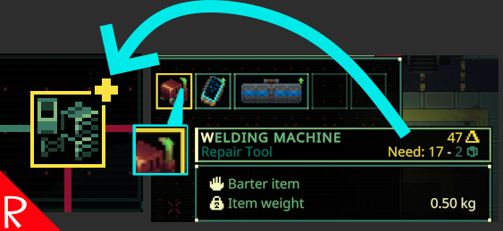

# Quasimorph Show Needed Upgrade Resources

## Important! Opt In Beta Only

Unfortunately this mod is only available for the Quasimorph's opt in beta, not the current release.

# Docs
Ever been in the dungeon and trying to remember if a resource is still needed for Magnum upgrades?

This mod simplifies the process by adding a green arrow to any resource items that are still needed for Magnum upgrades.
The tooltip for the item also includes a "Needs X:" line which indicates how many of that resource is still needed.

When in a raid, the green arrow will show for resources that need an upgrade *and* there is not enough already in the ship's cargo.
This does not change when an item is picked up.

When on the space ship, the green arrow will always show if a future upgrade needs the resource.

# Support
If you enjoy my mods and want to buy me a coffee, check out my [Ko-Fi](https://ko-fi.com/nbkredspy71915) page.
Thanks!

# Source Code
Source code is available on GitHub at https://github.com/NBKRedSpy/QM_ShowUpgradeResources

# Change Log

## 1.0.2
* Changed green icon functionality.  
    * When in raid, doesn't show arrow if there is enough in the Magnum.
    * When in ship, always shows the arrow if a future upgrade still needs the resource.